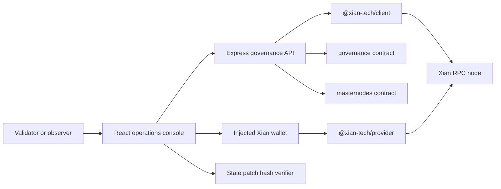

# xian-governance-web

`xian-governance-web` is the validator operations console for Xian
governance. It gives validators and observers one browser surface for chain
status, protocol proposals, validator-governance proposals, voting state,
active validators, pending candidates, scheduled state patches, and local
state-patch bundle verification.

The app is a TypeScript full-stack web app: a small Express API reads chain
state through `@xian-tech/client`, while the React client submits governance
transactions through the injected Xian wallet provider from
`@xian-tech/provider`. The backend is read-only for governance actions; it
does not hold validator keys and does not proxy signed transactions.

## Governance Flow



## Quick Start

This repo consumes the Xian JS packages from the sibling `xian-js` checkout.
The expected local layout is:

```text
.../xian/
  xian-js/
  xian-governance-web/
```

Install dependencies and start the local development server:

```bash
npm install
npm run dev
```

The server binds to `http://127.0.0.1:4173` by default. In development,
Express serves the API and mounts Vite middleware for the React app.

For a production build:

```bash
npm run build
npm run start
```

`npm run build` compiles the Express server with `tsc` and writes the Vite
client bundle to `dist/client`. `npm run start` runs `dist/server/main.js`;
set `NODE_ENV=production` when running behind a production process manager so
Express serves the built client bundle.

## Principles

- **Validator operations, not marketing.** The first screen is a dense
  governance dashboard with actionable proposal, validator, and state-patch
  information.
- **Wallet-first signing.** Votes and proposal creation are submitted through
  the injected wallet provider. Users review and sign the exact chain call in
  their wallet.
- **Read-only backend.** The Express server reads chain state, normalizes it
  for the UI, and exposes simulation. It does not store private keys or submit
  validator transactions.
- **Two governance layers, one model.** Protocol governance from
  `governance` and validator governance from `masternodes` are normalized into
  common proposal, vote, validator, and state-patch types under `src/shared/`.
- **Direct RPC mode.** The current app reads current governance state directly
  from a configured Xian RPC node. It is not a persistent historical indexer.
- **SDK contract lives in `xian-js`.** RPC calls and injected-wallet behavior
  come from the sibling JS / TS SDK packages rather than repo-local copies.
- **State-patch hashes are deterministic.** The browser verifier uses the same
  canonical JSON ordering and SHA-256 bundle hash format expected by the
  chain-side state-patch workflow.

## Capabilities

| Area | What the app does |
| --- | --- |
| Dashboard | Shows chain height, chain id, active validator count, total voting weight, pending / expiring proposals, scheduled patches, and a "needs your vote" queue derived from the connected account's eligibility. |
| Proposals | Lists protocol and validator-governance proposals in one filterable view (layer, status, type, needs-my-vote, emergency, expiring-soon, free-text search) with status, type, generated title, vote totals, weights, and thresholds. |
| Proposal detail | Shows proposal metadata, threshold progress, an effect/risk preview, per-account eligibility, a voter matrix that distinguishes "not voted" from "ineligible", off-chain references (explicit URI plus links detected in summaries), raw payload JSON, and wallet-backed yes / no / expire actions. Signing is blocked on a wallet/network chain-id mismatch. |
| Proposal creation | Typed wizard for protocol contract-call, protocol state-patch, and all validator-governance vote types, with local validation, state-patch activation-height checks, an exact-call preview, and a `/simulate` preflight before signing through the injected wallet. |
| Validators | Displays active validators and pending candidates from the `masternodes` read surface, with a detail panel covering power, bonds, commission, reward key, endpoint, and jail state. |
| State patches | Lists scheduled patches returned by `governance.get_patch` with a detail panel, and verifies pasted bundle JSON against the canonical bundle hash — including a direct match check against a selected patch's on-chain `bundle_hash`. |
| Network settings | Shows governance parameters, validator-set policy (`masternodes.get_policy_config`), registration fee, and allowed vote types. |
| Simulation | Exposes a backend `/simulate` endpoint for read-only preflight calls through the configured Xian node. |

## Configuration

Copy `.env.example` to `.env` when the local defaults are not enough:

```bash
cp .env.example .env
```

| Variable | Purpose | Default |
| --- | --- | --- |
| `PORT` | HTTP port for the Express server. | `4173` |
| `XIAN_NETWORK_ID` | Stable network id used by API routes and React Query keys. | `local` |
| `XIAN_NETWORK_NAME` | Human-readable network name shown in the selector. | `Local Xian` |
| `XIAN_CHAIN_ID` | Optional chain id override used when the node status cannot provide one. | unset |
| `XIAN_RPC_URL` | Xian node RPC URL used for reads, ABCI queries, simulation, and wallet calls. | `http://127.0.0.1:26657` |
| `XIAN_DASHBOARD_URL` | Optional link target for an existing node dashboard. | `http://127.0.0.1:8080` |
| `XIAN_GOVERNANCE_CONTRACT` | Protocol-governance contract name. | `governance` |
| `XIAN_MEMBERSHIP_CONTRACT` | Validator-governance / membership contract name. | `masternodes` |
| `CORS_ORIGINS` | Comma-separated cross-origin allowlist for the API. Empty means same-origin only; `*` allows any origin. | unset (same-origin) |

The current config loader builds a single network from environment variables.
The shared `NetworkConfig` type already supports multiple networks, but
multi-network environment parsing is not implemented yet.

## Key Directories

- `src/server/` — Express API and chain read layer:
  - `main.ts` — runtime entrypoint, config loading, service wiring, and bind
    address.
  - `app.ts` — API routes, JSON middleware, error handling, and Vite /
    production frontend mounting.
  - `config.ts` — environment-driven network configuration.
  - `governanceService.ts` — proposal, vote, validator, overview, state-patch,
    and simulation normalization.
  - `rpc.ts` — `@xian-tech/client` wrapper plus ABCI query helpers.
- `src/client/` — React operations console:
  - `App.tsx` — dashboard, proposal list/detail, validators, state patches,
    proposal creation, and wallet-backed actions.
  - `api.ts` — typed frontend API client.
  - `wallet.ts` — injected-wallet discovery, account / chain tracking, voting
    calls, and vote eligibility helpers.
  - `styles.css`, `main.tsx` — app styling and Vite entrypoint.
- `src/shared/` — code shared across client and server:
  - `types.ts` — normalized governance API types.
  - `format.ts` — value coercion, title generation, and display helpers.
  - `statePatchHash.ts` — canonical state-patch bundle parsing and hashing.
- `tests/` — Vitest coverage for API behavior, React rendering, wallet-facing
  UI flows, and state-patch hash compatibility.
- `docs/implementation-proposal.md` — product and technical proposal that
  describes the broader governance-console target state.
- `vite.config.ts`, `tsconfig.json`, `tsconfig.server.json` — Vite, Vitest,
  browser TypeScript, and server TypeScript configuration.

## API Surface

The React app talks to the local Express API:

| Route | Purpose |
| --- | --- |
| `GET /api/health` | Lightweight health check. |
| `GET /api/networks` | Configured network list. |
| `GET /api/networks/:networkId/overview` | Chain status, validator count, voting weight, pending proposals, expiring proposals, scheduled patch count, and governance parameters. |
| `GET /api/networks/:networkId/proposals` | Unified protocol and validator-governance proposal list. Accepts `?account=` to attach per-viewer eligibility (`viewer`). |
| `GET /api/networks/:networkId/policy` | Validator-set policy (`masternodes.get_policy_config`), governance parameters, registration fee, and allowed vote types. |
| `GET /api/networks/:networkId/history` | Recent normalized governance events (BDS when available). |
| `GET /api/networks/:networkId/proposals/:layer/:proposalId` | Proposal detail for `protocol` or `validator` governance. Accepts `?account=` for viewer eligibility. |
| `GET /api/networks/:networkId/proposals/:layer/:proposalId/votes` | Voter records for one proposal. |
| `GET /api/networks/:networkId/validators` | Active validators and pending candidates. |
| `GET /api/networks/:networkId/state-patches` | State patches associated with protocol-governance proposals. |
| `POST /api/networks/:networkId/simulate` | Read-only transaction simulation through the configured node. |

## Chain Reads

The service currently uses a direct-RPC strategy:

- chain status from `XianClient.getStatus()`
- protocol proposals from `governance.proposal_count` and
  `governance.get_proposal`
- protocol vote records from `governance.get_members` plus
  `governance.proposal_votes` / `governance.proposal_vote_weights`
- validator proposals from `masternodes.total_votes` and
  `/masternodes_vote/<id>`
- validator vote records from `/masternodes_vote_records/<id>`
- active validators and candidates from `/masternodes_active` and
  `/masternodes_candidates`
- state-patch metadata from `governance.get_patch`

This keeps the app useful against a plain node. Historical event timelines,
transaction hashes, node readiness attestations, and BDS-backed backfills are
future indexer work described in `docs/implementation-proposal.md`.

## Validation

```bash
npm install
npm run typecheck       # browser + server TypeScript
npm run test            # Vitest unit / component / API tests
npm run build           # server compile + Vite production build
npm run validate        # typecheck + test + build
```

Run the app against a local Xian node for functional validation:

```bash
cd ../xian-stack
python3 ./scripts/backend.py start --no-bds-enabled --dashboard
python3 ./scripts/backend.py endpoints --no-bds-enabled --dashboard

cd ../xian-governance-web
npm run dev
```

Connect the browser wallet to the same chain id and RPC URL before testing
votes or proposal creation.

## Deployment Notes

- The process binds to `127.0.0.1`, so production deployments normally place a
  reverse proxy in front of it.
- Set `NODE_ENV=production` before `npm run start` so the server serves
  `dist/client` instead of mounting Vite middleware.
- Configure `XIAN_RPC_URL` to a node reachable from the server and configure
  the browser wallet to the same network before signing.
- Keep TLS, CSP, authentication / network access policy, and validator
  allowlisting at the reverse-proxy or hosting layer. This app does not add an
  operator login boundary by itself.
- Treat proposal summaries, URIs, and JSON payloads as untrusted input. The UI
  renders them as text / JSON and only opens `http` or `https` off-chain
  references.

## Requirements

- Node.js compatible with the installed Vite / TypeScript toolchain
- npm
- sibling `xian-js` checkout for local `@xian-tech/client`,
  `@xian-tech/provider`, and `@xian-tech/types` file dependencies
- reachable Xian RPC node
- Xian browser wallet for voting and proposal creation

## Related Docs

- [`../xian-js/README.md`](../xian-js/README.md) — JS / TS SDK and injected provider consumed by this app
- [`../xian-wallet-browser/README.md`](../xian-wallet-browser/README.md) — browser wallet used for governance signing
- [`../xian-stack/README.md`](../xian-stack/README.md) — local Xian stack for development and validation
- [`../xian-configs/README.md`](../xian-configs/README.md) — governance and `masternodes` contract configuration
- [`../xian-docs-web/README.md`](../xian-docs-web/README.md) — public Xian documentation site
