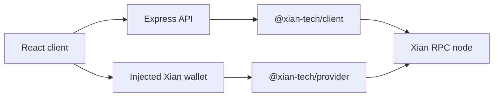

# Architecture

`xian-governance-web` is a validator governance operations console. It combines
a small Express read API with a React client that submits signed governance
actions through the injected Xian browser wallet provider.

## Components

- `src/server/main.ts`: runtime entrypoint, configuration loading, and server
  startup.
- `src/server/app.ts`: Express app, API routes, middleware, and Vite or static
  client mounting.
- `src/server/config.ts`: environment-driven network configuration.
- `src/server/rpc.ts`: `@xian-tech/client` wrapper and ABCI query helpers.
- `src/server/governanceService.ts`: normalized governance read model for
  proposals, complete validator lifecycle/stake/slash state, votes, state
  patches, policy, history, and simulation.
- `src/client/App.tsx`: React operations console, proposal workflows,
  validator views, state-patch verification, and wallet-backed actions.
- `src/client/wallet.ts`: injected wallet discovery and request submission.
- `src/shared/`: normalized API types, formatting helpers, and state-patch hash
  logic shared by client and server.

## Runtime Flow



## Dependency Direction

- The app consumes JS SDK packages from the sibling `xian-js` repo.
- The server is read-only for governance actions and never holds validator
  private keys.
- The browser signs governance transactions through the injected wallet
  provider.
- Shared state-patch hash logic lives in `src/shared/` so the UI and tests use
  the same canonical JSON behavior.

## Boundaries

- This repo is not a historical governance indexer. It reads current node state
  directly and exposes normalized API responses for the UI.
- Authentication, TLS, CSP, validator allowlisting, and network exposure policy
  belong at the hosting or reverse-proxy layer.
- Multi-network environment parsing is not implemented yet; the current config
  loader builds one network from environment variables.

## Validation

```bash
npm install
npm run validate
```
